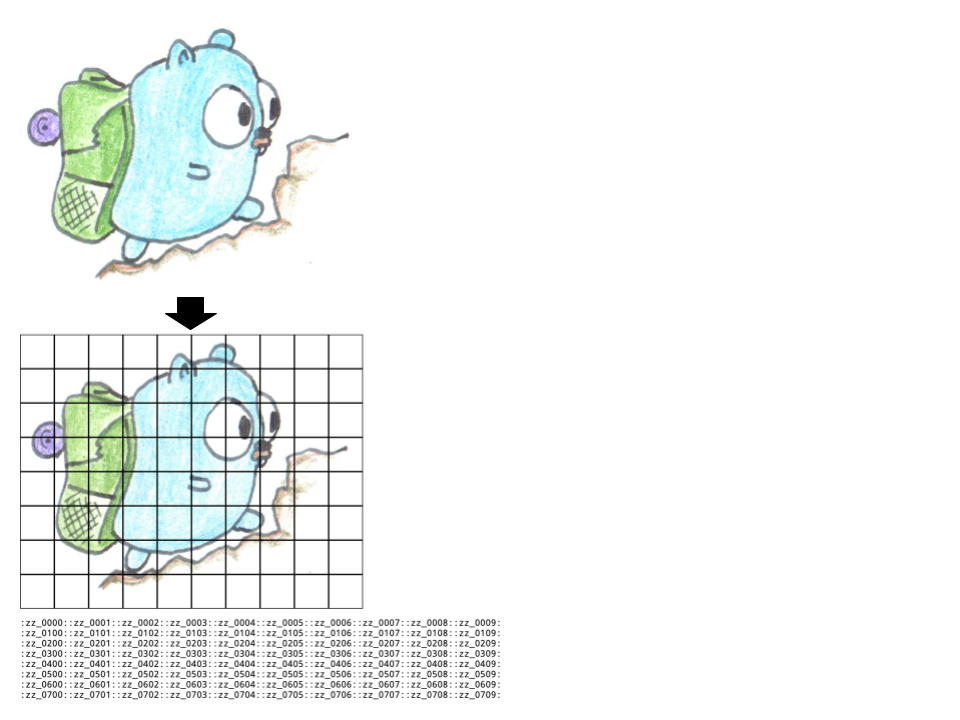

# ajk-emoji



Run:

```bash
# this command writes image files as "img/zz_xxxx.png"

go run . -html -op img/zz_ -os .png -x 10 < ~/Pictures/input.png > /tmp/preview.html && open /tmp/preview.html
```

Configuration:

    STDIN
          input image
    -html
          outputs html
    -op string
          output filepath prefix (default "img/zz_")
    -os string
          output filepath suffix (default ".png")
    -x int
          number of columns (default 10)
